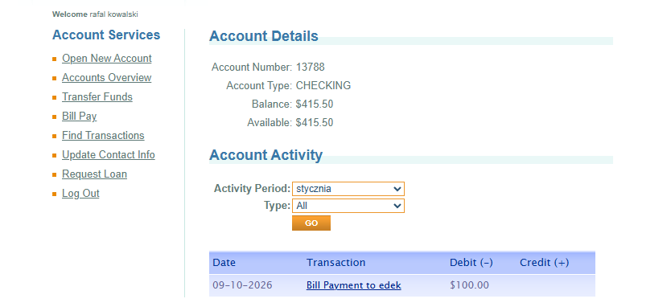

# BUG-001 — Transaction History Displays Transactions Outside the Selected Activity Period

## Bug Details

| Field | Value |
|---|---|
| **Bug ID** | BUG-001 |
| **Module** | Accounts / Transaction History |
| **Type** | Functional |
| **Priority** | Medium |
| **Status** | Open |
| **TestRail Case ID** | C63 |
| **TestRail Test ID** | T122 |
| **Related Test Case** | Filter transactions by activity period |
| **Test Result** | Failed |

## Description

The transaction history filtering functionality does not respect the activity period selected by the user.

After selecting **January** from the Activity Period filter, a transaction from **September** is still displayed in the transaction list.

## Preconditions

- The user is logged in to ParaBank.
- The user has at least one account.
- The selected account contains transaction history.

## Steps to Reproduce

1. Log in to ParaBank using valid credentials.
2. Navigate to **Accounts Overview**.
3. Open an account containing transaction history.
4. Select **January** from the **Activity Period** dropdown.
5. Click the **Go** button.
6. Review the displayed transaction list.

## Expected Result

Only transactions matching the selected activity period (**January**) should be displayed.

## Actual Result

A transaction from **September** is displayed even though **January** is selected as the activity period.

## Environment

- **Application:** ParaBank Demo
- **Platform:** Web
- **Operating System:** Windows 11
- **Browser:** Google Chrome

## Evidence

Screenshot showing the selected activity period and the incorrectly displayed transaction.

