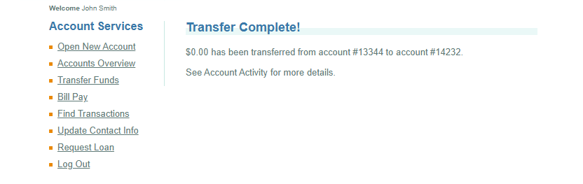

# BUG-002 — Fund Transfer Can Be Completed With a Zero Amount

## Bug Details

| Field | Value |
|---|---|
| **Bug ID** | BUG-002 |
| **Module** | Fund Transfer |
| **Type** | Validation / Functional |
| **Priority** | Medium |
| **Status** | Open |
| **TestRail Case ID** | C67 |
| **TestRail Test ID** | T126 |
| **Related Test Case** | Transfer funds with zero amount |
| **Test Result** | Failed |

## Description

The Fund Transfer functionality accepts a transfer amount of **$0.00**.

The application completes the transaction instead of rejecting the zero-value amount and displaying a validation message.

## Preconditions

- The user is logged in to ParaBank.
- The user has at least two accounts available for fund transfer.

## Steps to Reproduce

1. Log in to ParaBank.
2. Navigate to **Transfer Funds**.
3. Enter `0` in the **Amount** field.
4. Select a source account.
5. Select a different destination account.
6. Click the **Transfer** button.

## Expected Result

The transfer should not be processed.

The application should display an appropriate validation message informing the user that the transfer amount must be greater than zero.

## Actual Result

The application accepts the amount of **$0.00** and completes the fund transfer successfully.

## Environment

- **Application:** ParaBank Demo
- **Platform:** Web
- **Operating System:** Windows 11
- **Browser:** Google Chrome

## Evidence

Screenshot showing the successful transfer of $0.00.

