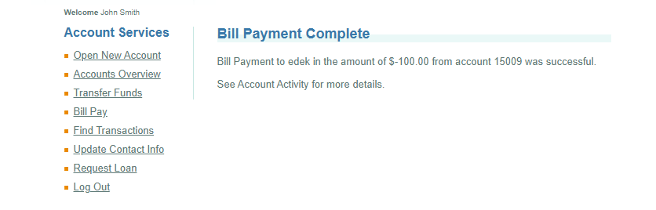

# BUG-003 — Fund Transfer Can Be Completed With a Negative Amount

## Bug Details

| Field | Value |
|---|---|
| **Bug ID** | BUG-003 |
| **Module** | Fund Transfer |
| **Type** | Validation / Functional |
| **Priority** | High |
| **Status** | Open |
| **TestRail Case ID** | C68 |
| **Related Test Case** | Transfer funds with negative amount |
| **Test Result** | Failed |

## Description

The Fund Transfer functionality accepts a negative transfer amount.

A user can enter a value such as **-$100.00** and the application processes the transaction instead of rejecting the invalid amount.

## Preconditions

- The user is logged in to ParaBank.
- The user has at least two accounts available for fund transfer.

## Steps to Reproduce

1. Log in to ParaBank.
2. Navigate to **Transfer Funds**.
3. Enter `-100` in the **Amount** field.
4. Select a source account.
5. Select a different destination account.
6. Click the **Transfer** button.

## Expected Result

The transfer should be rejected.

Negative values should not be accepted as valid transfer amounts and no transaction should be processed.

## Actual Result

The application accepts the negative amount and completes the fund transfer successfully.

## Environment

- **Application:** ParaBank Demo
- **Platform:** Web
- **Operating System:** Windows 11
- **Browser:** Google Chrome

## Evidence

Screenshot showing the successful transaction with a negative amount.

