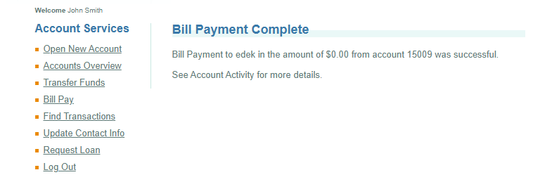

# BUG-004 — Bill Payment Can Be Completed With a Zero Amount

## Bug Details

| Field | Value |
|---|---|
| **Bug ID** | BUG-004 |
| **Module** | Bill Pay |
| **Type** | Validation / Functional |
| **Priority** | Medium |
| **Status** | Open |
| **TestRail Case ID** | C78 |
| **TestRail Test ID** | T137 |
| **Related Test Case** | Bill payment with zero amount |
| **Test Result** | Failed |

## Description

The Bill Pay functionality allows a payment to be submitted with an amount of **$0.00**.

The application processes the payment instead of rejecting the zero-value amount.

## Preconditions

- The user is logged in to ParaBank.
- The Bill Pay page is accessible.
- A valid source account is available.

## Steps to Reproduce

1. Log in to ParaBank.
2. Navigate to **Bill Pay**.
3. Enter valid payee information.
4. Enter matching account numbers.
5. Enter `0` in the **Amount** field.
6. Select an account to pay from.
7. Click **Send Payment**.

## Expected Result

The payment should not be processed.

The application should display an appropriate validation message informing the user that the payment amount must be greater than zero.

## Actual Result

The bill payment is completed successfully with an amount of **$0.00**.

## Environment

- **Application:** ParaBank Demo
- **Platform:** Web
- **Operating System:** Windows 11
- **Browser:** Google Chrome

## Evidence

Screenshot showing the successful $0.00 bill payment.

