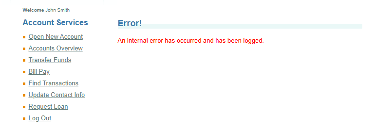

# BUG-006 — User Profile Information Cannot Be Updated

## Bug Details

| Field | Value |
|---|---|
| **Bug ID** | BUG-006 |
| **Module** | Update Contact Info |
| **Type** | Functional |
| **Priority** | High |
| **Status** | Open |
| **Related Test Cases** | T140, T144 |

## Description

The user is unable to update their profile information.

After entering valid new profile data and attempting to save the changes, the application does not update the information correctly.

This issue also prevents verification that updated profile information persists after logging out and logging in again.

## Preconditions

- The user is logged in to ParaBank.
- The **Update Contact Info** page is accessible.

## Steps to Reproduce

1. Log in to ParaBank.
2. Navigate to **Update Contact Info**.
3. Change one or more profile fields using valid data.
4. Click **Update Profile**.
5. Observe the application response.
6. Reopen the profile page and verify the information.

## Expected Result

The profile should be updated successfully.

The new information should be saved and displayed correctly when the profile page is opened again.

## Actual Result

The profile information cannot be updated successfully and the new data is not saved.

As a result, test case **T144 — Verify updated profile data persists after re-login** cannot be completed.

## Environment

- **Application:** ParaBank Demo
- **Platform:** Web
- **Operating System:** Windows 11
- **Browser:** Google Chrome

## Impact

The user cannot maintain or update their contact information.

This defect also blocks further testing related to persistence of updated profile data.

## Evidence

Screenshot showing the failed profile update.

