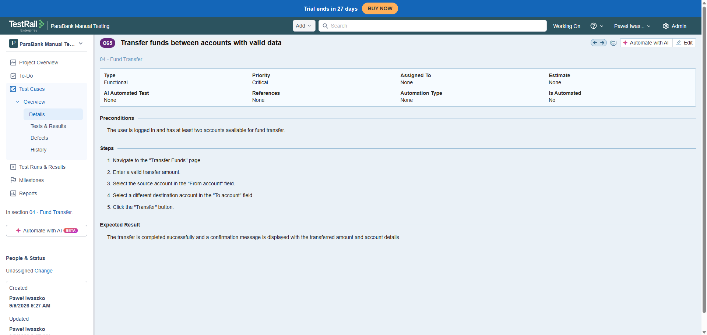
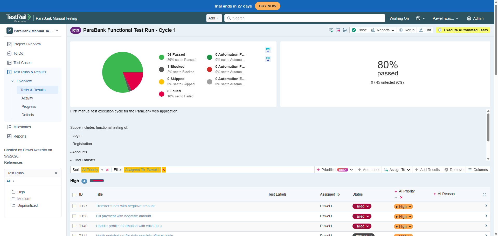

# 🧪 TestRail — Test Management & Execution

This folder contains evidence of test case management and test execution performed in **TestRail** for the ParaBank Manual Testing project.

A total of **45 manual test cases** were created, organized into functional sections, and executed in TestRail.

The TestRail project is private, therefore exported test cases and test execution evidence are included in this repository for portfolio purposes.

---

## 📋 Test Cases

The complete set of 45 test cases exported from TestRail is available here:

➡️ [View / Download Test Cases](./parabank_manual_testing (1).xlsx)

The test cases include preconditions, test steps, expected results, and other information used during test execution.

---

## 🔎 Test Case Example

Below is an example of a detailed test case created in TestRail.

---

## 📊 Test Execution

The prepared test cases were executed as part of a dedicated Test Run in TestRail.

The execution included **Passed, Failed, and Blocked** test results.

---

## 🐞 Defects

Defects identified during test execution were documented separately as structured bug reports.

➡️ [View Bug Reports](../bug-reports/)

Detailed test execution results and conclusions are available in the Test Summary Report.

➡️ [View Test Summary Report](../test-documentation/04_Test_Summary_Report.md)
